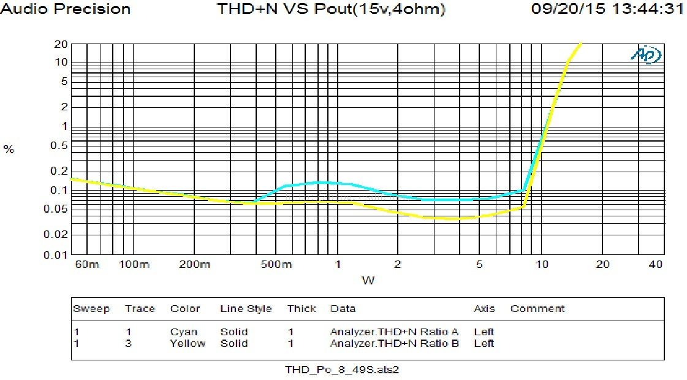
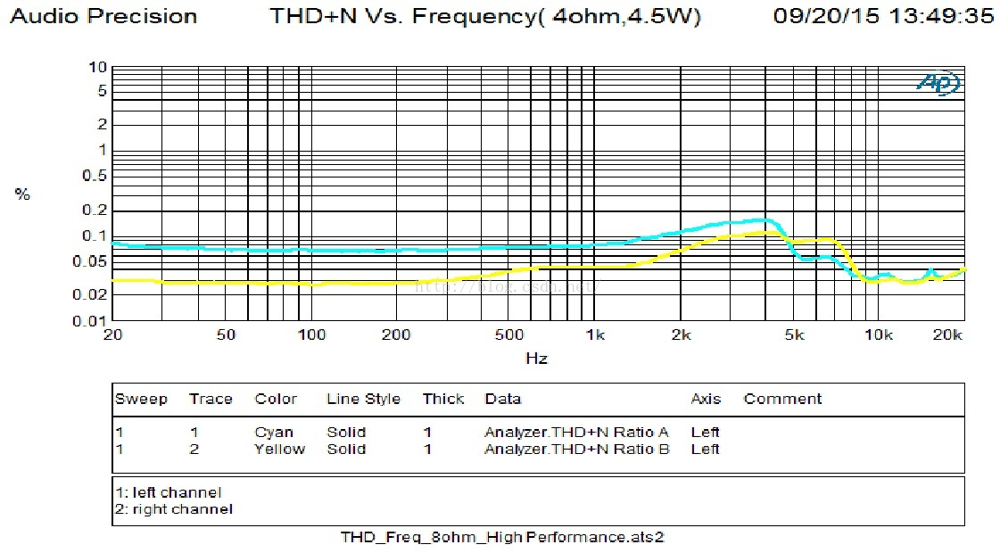
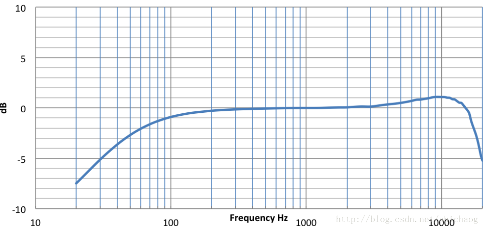
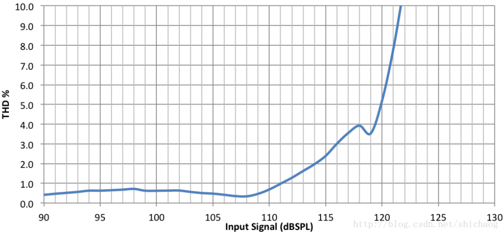
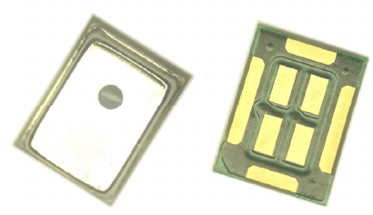

**Chapter 1 Structure and Device**

In real applications, the acquisition of voice is often obtained in the form of
hardware products, and the fluctuation characteristics of sound transmission
must take the product structure as a factor.

For structural design, it is mainly the influence of structural design on the
signal collected by the microphone, including structural vibration, cavity
effect, sound guide hole, self-excited amplification of sound cavity resonance,
and most products now have both a microphone and a speaker, and the speaker
emits The sound will be collected by the microphone, and the speaker signal
collected (implemented by hardware or software) will have a greater impact on
the final AEC (Echo Cancellation).

**speaker**

**Electrical performance**

The commonly used electrical performance test equipment on audio equipment is
AudioPrecision. Here are the indicators that are more concerned about. The
construction of the test environment is skipped here.

| **test item** | **The meaning of the project**   | **Affected acoustic properties**                                                                                                                                                                        |
|---------------|----------------------------------|---------------------------------------------------------------------------------------------------------------------------------------------------------------------------------------------------------|
| THD+N         | Total Harmonic Distortion +Noise | It describes the harmonic distortion and noise of the power amplifier device at a given power, which means that after the power amplifier device, the sound is different from the original sound source |
| SNR           | Signal to noise Ratio            | It reflects the ratio of signal to noise. Under the premise of no distortion, the bigger the better                                                                                                     |
| Crosstalk     |                                  | It reflects the influence of one channel on the other channel, which is usually a good influence. We hope to have two speakers for the left and right channels to enhance the three-dimensionality.     |
| Distortion    |                                  | After the sound of different frequencies passes through the power amplifier device, the distortion is different                                                                                         |
| DC offset     |                                  | It reflects the output of the power amplifier device when there is no sound input                                                                                                                       |

Generally speaking, audio codec devices and power devices (also two-in-one) have
basically negligible impact on ASR due to their electrical characteristics, but
you need to pay attention to the distortion when the power is at maximum, but
for HIFI-level high-quality scenes, Normally, under certain power, THD+N full
frequency band (20Hz\~20KHZ) should be below 1%. If you want to see the complete
test report, please click on the following test example link: [Audio Precision
test report example](https://github.com/shichaog/WebRTC-audio-processing/blob/master/AudioPrecision_test.pdf) Generally speaking, the power amplifier chip will have a codec (TI/yamaha and Nuvoton), this codec can compensate for the final sound effects, including EQ Etc. In a
scene with a speaker, AEC is usually done. In addition to structural avoidance,
the THD of the speaker in the range of 150\~7kHz is below 5%, because usually
the speaker volume is consistent with the speaker volume, while the microphone
The distance to the speaker is usually much closer than the distance between the
person and the speaker. The speaker volume collected by the microphone is
usually more than 20dB louder than the human voice. This requires the microphone
and speaker to be placed as far as possible.

**Acoustic performance**

Acoustic performance mainly refers to the mechanical vibration of the horn and
the radiating basin. Ideally, the reciprocating movement of the horn and the
radiating basin is linear, that is, the distance between the horn and the
forward and the output power are linear (L = k xL=kx) Relationship, but in fact,
when the output power is very small or the output power exceeds the rated power,
when the magnetic energy converted by the electrical energy is converted into
the mechanical energy of the spring, their respective parts are not linear,
which leads to the playback The sound and the SDR (signal distortion ratio)
before entering the power amplifier device become larger. An intuition is that
when the spring is pulled to a certain level, the ratio of the force given to
the distance pulled by the spring changes, which will cause the final speaker
The air being pushed is not proportional, and distortion is caused by this; in
terms of acoustic performance, a laser will be used to test the vibration of the
horn. In addition, the choice of magnetic material is also a deep knowledge, so
the design of the horn is usually Designed for a special speaker company. Since
the speaker will emit sound, the effect of (AEC) is also related to this part.
The closer the reference signal to the AEC is to the broadcast, the better.

**Electroacoustic testing instrument AduioPrecision**

This is not an advertisement, but a look at the specific report details of the
test through a professional instrument. The test items are as follows:

test item

The detailed report is at the following
address: <https://github.com/shichaog/papers/blob/master/sound_ele_test.pdf>

**THD+N vs POUT**

Total Harmonic Distortion + Noise; Total harmonic distortion plus noise, a major
performance index of audio power amplifiers, is a condition of the rated output
power of audio power amplifiers. Response nature: the degree of distortion of
the amplified sound, which has an impact on the AEC algorithm. General range:
0.00n%～10% General test conditions: FIN = 1KHz

For an ideal audio power amplifier, if the gain of the power amplifier is not
considered, a sine wave signal of a certain frequency is input, and the output
should also be a sine wave signal without distortion (no change in
waveform)/noise. However, the output audio signal of a real audio power
amplifier will always be a bit distorted and superimposed with noise
(high-frequency clutter is superimposed on the sine wave). This distortion is
small, and it is difficult to see from the waveform diagram. Distortion meter
can only be measured. The distortion of the waveform is caused by the addition
of a variety of high-frequency harmonics to the sine wave (3rd harmonic, 5th
harmonic), so it is called total harmonic distortion.

AP test THD+N vs POUT results

AP test THD+N vs Frequency

**microphone**

The indicators that a general microphone needs to pay attention to are as
follows:

| **index**            | **significance**                                                                                                        |
|----------------------|-------------------------------------------------------------------------------------------------------------------------|
| sensitivity          | Can detect the minimum sound pressure sound (such as -27dBFS)                                                           |
| SNR                  | Also pay attention to the sound of the noise introduced by the microphone itself on the signal quality                  |
| AOP                  | Acoustic Overload Point, excessive sound pressure causes more than 10% distortion, which affects the use of the product |
| Frequency Response   | How consistent is the microphone amplifying different frequency signals under different sound pressures                 |
| sound pressure level | The sound pressure level, for the far field of the speaker, the sound pressure is still larger, such as 140dB SPL       |

The 16bit microphone indicates the SPL range of 70dB, which is not enough for
the far-field speaker scene. 6W. In addition, it depends on the dynamic error of
the batch product, the influence of temperature and humidity (the temperature
drift of the ADC device), etc. Because the human voice pronunciation range is
20Hz\~ 20KHz, general microphone∑ − Δ∑−ΔThe cutoff frequency is set above 20KHz.
According to the Nyquist theorem, if the spectrum aliasing is not generated, it
means the sampling ratefs≥ 40 k Hzfs≥40kHzIn order to facilitate the resampling
algorithm, many system designs will use 48KHz sampling and then convert it to
16KHz (usually the ASR system acoustic feature extraction is extracted by
installing 16KHz, which is a comprehensive consideration of the data processing
volume and performance). The above is a single The indicator of a microphone, in
order to facilitate applications such as far-field speech recognition, most
products use an array of multiple microphones as the source of sound acquisition
of the voice device. Due to the needs of the algorithm, the problem of channel
consistency usually occurs. (Adaptive channel equalization technology is often
used in radar systems), but this is rarely used in the case of microphone
arrays, and the phase consistency between microphones is also very important.

-   Microphone collection

-   The sampling rate, the cutoff frequency is 8KHz, which requires the sampling
    ratefs≥ 16 KHzfs≥16KHz, In order to prevent the spectrum from mixing,
    usually the sampling rate is greater than16 KHz16KHz, After resampling
    to16 KHz16KHz

-   In order to reduce voice distortion, AGC is usually not added in the
    processing process, and NS is not added if it is possible (if the server has
    anti-noise training, if it cannot handle noise, ns is also required)

-   Avoid clipped speech (AOP should be high,120 dB \@ 1 KHz120dB\@1KHz), the
    peak level should be -20\~10dBFS

-   The spectrum is as flat as possible (± 3 dB±3dB,100 − 8000 Hz100−8000Hz),
    there are two meanings, one is that the microphone frequency spectrum
    requires as much frequency as possible, and the other is that the sound
    propagation loss needs to be pre-emphasized to enhance it.

-   The total harmonic distortion should be small, less than 1%
    (from100 Hz− 8 KHz, \@ 90 dB SPL100Hz−8KHz,\@90dBSPL)

-   SNR should be high (≥ 65 dB≥65dBBest) to reduce the noise caused by the ADC
    device itself.

-   Sampling the effective number of bits, which affects the signal-to-noise
    ratio, which is greater than or equal to 16bit

-   Voice transmission to the server, the recognition rate from good to bad
    (network bandwidth from large to small) is: FLAC/LINEAR16, AWR_WB, OGG_OPUS

Figure 1.1 Example of spectral flatness

Figure 1.2 THD example

Production line mass production test method: DTMF (dual tone multi-frequency)
sound source.

**Structural design**

The structural design will bring vibration, and the appearance of the product
will bring about the influence of the cavity structure.

Figure 1.3 Silicon wheat

The picture above is a silicon microphone with top output sound (in addition to
bottom output, the acoustic characteristics of the two openings are usually
different, and it is also influential when generating wave soldering in
batches). Generally, the microphone in the above picture It is not exposed in
the air, but in the appearance of the product. This is equivalent to putting the
microphone in the cavity. The signal collected by the microphone is no longer in
the free field scene. For vibration conditions, rubber or suspension can usually
be sampled. In addition, the speaker and microphone are placed on the two poles
with the largest physical size, and the cavity is usually sampled closely or set
up with a sound guide (standing wave). Finally, it is necessary to test the
amplitude of the multi-channel microphone under the frequency sweep The
corresponding consistency of frequency and phase frequency verifies the
rationality of structural design such as pilot holes.

**Hardware equipment**

When doing audio and sound effects related algorithms, in addition to looking at
the time-frequency domain visual map, it is also essential to listen with ears.
Good monitoring equipment can make people feel the sound more fine-grained, in
order to reduce electroacoustics (electronic devices) And mechanical) loss
requires good hearing equipment.

**Listening equipment**

When evaluating the performance of hardware and algorithms, it is necessary to
use monitor headphones to actually listen to the details of the input and output
sound signals of each link. To evaluate the quality of the monitor headphones,
mainly the low, medium and high three frequency bands and the expressiveness of
the sound field. I recommend the Sony MDR7506 and ATH-M40x, but not Sennheiser
HD280. If you test monitor headphones or high-quality speakers, the Companion 20
of the 2,000-priced Boss is good, and the 3,000-priced speakers, Hivi x4, and
Zenith 8010a are all cost-effective. The recommended test songs and test methods
are as follows: Song Yidukou (Cai Qin) Measure the bass and vocals. The first
three drums should be heavy and powerful, and can dive deeper. At the same time,
the first three drums should be clear and not muddy; when the vocals and drums
appear at the same time, pay attention to the vocals and drums. Their respective
performance;

Song 2: Hotel California (Live) tests the performance of the **sound field** ,
starting at 1:20, pay attention to listening to various sounds, and test whether
you have an immersive feeling;

Song 3: Snow Feiyang (Guo Feng) Snow (Guo Feng) Electronic musical instrument
synthesis, all frequency bands are available, to test the overall performance
tension.

Song 4: Shadow (Faye Wong), Heaven (Tengger) Crying Sand (Huang Yingying) Test
human voice: Faye Wong's voice in the shadow is sad and sensual, slightly
hoarse, with clear lips and teeth; Tengger in heaven is explosive and dynamic
The range is much larger than the average singer. Crying Sha put aside the
poignant love story she told, and listened to the details of the human voice
quietly.

You can also use Hivi's audio test discs, non-top equipment does not use sky
discs, and the audio test source is guaranteed to be lossless. If you want the
above lossless audio source, please contact us through the WeChat QR code in the
profile.

**Expressive sound field**

The picture shows the arrangement of some speakers and bass radiating basins in
a theater. In the theater, you can listen carefully to the separation and
clarity of musical instruments such as vocals and drums. You can also pay
attention to the direction of the sound. Feel the feeling of being there. Keep
this feeling in mind, and compare the effects of your own speakers. 

**Electron tube**

Totally interested to see [the full version of the video](http://www.iqiyi.com/w_19s5ptwlr1.html) 

**Test equipment**

It is recommended to use audio precision555 to test electro-acoustic equipment,
whether it is an ASR or a conference room; to test the electrical performance of
microphones and speaks, as well as the acoustic performance of the structure,
there is some algorithmic dependence, such as the THD that the AEC algorithm
hopes the power amplifier will bring Try to be as small as possible to obtain a
good AEC effect. Most AEC algorithms use THD equal to 5%. The smaller the
better, but it is also inseparable from external conditions. Electrical
parameters such as THD can be directly measured using AP. Accurate acoustic
testing is also An anechoic room environment is needed. Relative testing can be
done unconditionally. After the test is satisfied, the anechoic room can be
rented for accurate testing.

**Concluding remarks**

In order to design a good ASR and video conference system, it is necessary to
understand the structure and electro-acoustic characteristics. In addition, if
it is a mass-produced product, it is not enough to consider ASR alone, but also
to consider the stability of the supply chain. Convenience and efficiency of
production test.
